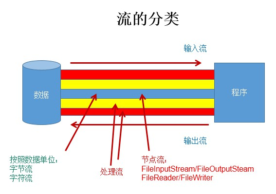
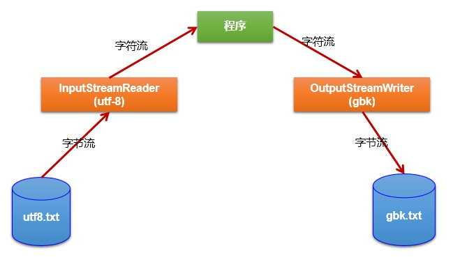

I/O 即 Input/Output，用于处理设备之间的数据传输，如文件读写、网络通讯，Java 中对于数据的输入输出操作以 “流 stream” 的方式进行，java.io 包下提供了各种 “流” 的类和接口

## File类
java.io.File 类，该类的一个对象就代表一个文件或目录（文件夹），File 类中涉及关于文件或文件目录的创建、删除、重命名、返回修改时间、文件大小等方法，但不涉及文件的读写，File 类的对象常作为参数传入流对象的构造器中。

### 构造器
* File(String filePath)
* File(String parentPath,String childPath)
* File(File parentFile,String childPath)

**注意**
* 形参可以是文件名或者文件夹的路径，可以是绝对路径或相对路径
* Windows 和 Dos 使用 “ \ ” 作为路径分隔符，在字符串中要使用转义符  
* Unix 和 URL 使用 “ / ” 作为路径分隔符
* 可以使用统一的分隔符常量 public static final String separator
```java
File f1 = new File("d:" + File.separator + "github" + File.separator + "github.txt"); 
// d:\github\github.txt  
```
* IDEA中，如果使用 JUnit 进行单元测试，相对路径从当前 Module 开始，如果使用 main() 函数进行测试，相对路径从当前 Project 开始 

### 常用方法
#### 获取
```java
public String getAbsolutePublic();
// 获取绝对路径
public String getPath();
// 获取路径
public String getName();
// 获取名称
public String getParent();
// 获取上层文件目录路径，若无，返回 null
public long length();
// 获取文件长度，即字节数，不可获取目录的长度
public long lastModified();
// 获取最后一次修改实践
```
#### 重命名
```java
public boolean renameTo(File dest);
把文件重命名为指定的文件路径
```

#### 判断
```java
public boolean isDirectory();
// 判断是否是目录
public boolean isFile();
// 判断是否是文件
public boolean exists();
// 判断是否存在
public boolean canRead();
// 判断是否可读
public boolean canWrite();
// 判断是否可写
public boolean isHidden();
// 判断是否隐藏
```

#### 创建
```java
public boolean creatNewFile();
// 创建文件，若文件已存在，则不创建，返回 false
public boolean mkdir();
// 创建目录，若目录已存在，则不创建，若此目录上层目录不存在，也不创建
```

#### 删除
```java
public boolean delete();
// 删除文件或一个空的目录，不走回收站
```

## IO 流原理及流的分类
相对于程序、内存来说，从外围设备**读数据**到内存为输入，从内存**写数据**到外围设备为输出

### 流的分类
* 按操作数据单位：字节流（每 8 bit（1字节） 一个单位）、字符流（每 16 bit 一个单位）
* 按数据的流向：输入流、输出流
* 按流的角色：节点流（直接连接内存和文件）、处理流
* 字符流：字节流读取文字字节数据后，不直接操作而是先查指定的编码表，获取对应的文字，再对这个文字进行操作，简单说就是字节流+编码表


|抽象基类|字节流|字符流|
|---|---|---|
|输入流|InputStream|Reader|
|输出流|OutputStream|Writer|




|抽象基类|InputStream|OutputStream|Reader|Writer|
|---|---|---|---|---|
|节点流|FileInputStream|FileOutputStrem|FileReader|FileWriter|
|缓冲流|BufferedInputStream|BufferedOutputStrem|BufferedReader|BufferedWriter|

### 输入输出的标准化过程
**输入过程** 
1. 创建 File 类的对象，指明读取的数据的来源（要求此文件一定要存在）
2. 创建相应的输入流对象，将 File 类的对象作为参数，传入流的构造器中
3. 具体的读入过程，使用 read() 方法，根据字节流或字符流的类型创建相应的 buffer 数组 byte[] 或 char[]
4. 关闭流资源

**输出过程**
1. 创建File类的对象，指明写出的数据的位置（不要求此文件一定要存在）
2. 创建相应的输出流，将 File 类的对象作为参数，传入流的构造器中
3. 具体的写出过程，使用 write() 方法
4. 关闭流资源

**说明**  

程序中出现的异常需要使用 try-catch-finally 处理

## 节点流（文件流）
* 输入操作（读），相应的 File 一定要存在，否则就会报 FileNotFoundException
* 输出操作（写），相应的 File 可以不存在，不会报异常
* 异常的处理：为了保证流资源一定可以执行关闭操作。需要使用try-catch-finally处理
* 无参 read() 方法，每次读入一个单位内容，到达文件末尾返回-1，若缓冲区（一个数组）作为参数传入，每次读取尽量装满缓冲区，返回每次读入内容单位的个数，到达文件末尾返回-1
* 写操作（FileWriter 和 FileOutputStream 同理）
    * File 对应的硬盘中的文件如果不存在，在输出的过程中，会自动创建此文件。
    * File 对应的硬盘中的文件如果存在：
        * 如果流使用的构造器是：FileWriter(file,false) / FileWriter(file):对原文件的覆盖
        * 如果流使用的构造器是：FileWriter(file,true):不会对原文件覆盖，而是在原文件基础上追加内容
* 对于文本文件(.txt，.java，.c，.cpp)，建议使用**字符流**处理
* 对于非文本文件(.jpg，.mp3，.mp4，.avi，.doc，.ppt，...)，**必须使用字节流**处理
### FileReader 和 FileWriter
FileRead 和 FileWriter 实现问本文件的复制
```java
import java.io.*;

public class FileTest {
    public static void main(String[] args) {
        // 1. 创建 File 类的对象，指明数据来源，路径是相对于 Project 的
        File srcFile = new File("FileIO/hello1.txt");
        File destFile = new File("FileIO/hello2.txt");

        FileReader fr = null;
        FileWriter fw = null;
        try {
            // 2. 创建输入流对象，并将 secFile 作为参数传入构造器
            fr = new FileReader(srcFile);
            // 创建输出流对象，并将 destFile 作为参数传入构造器
            // 如果没有该文件，则新建
            fw = new FileWriter(destFile,true);

            // 字符串用于存储所以文本内容
            StringBuffer str = new StringBuffer();
            // 读取操作的缓冲区
            char[] cbuf = new char[5];
            // 记录本次读取所读的字符个数
            int len;

            // 3. 读入数据同时写出数据
            while((len=fr.read(cbuf))!=-1) {
                str.append(cbuf,0,len);
                fw.write(cbuf,0,len);
                //String s = new String(cbuf,0,len);
                //System.out.print(s);
            }
            System.out.println(str);
        } catch (IOException e) {
            e.printStackTrace();
        } finally {
            // 4. 关闭流资源
            try {
                if(fr!=null)
                    fr.close();
            } catch (IOException e) {
                e.printStackTrace();
            }
            try {
                if(fw!=null)
                    fw.close();
            } catch (IOException e) {
                e.printStackTrace();
            }
        }
    }
}
```
### FileInputStream 和 FileOutputStream
FileInputStream 和 FileOutputStream 实现视频文件的拷贝，并封装到方法，测定拷贝时间
```java
import java.io.*;

public class FileInputStreamOutputStreamTest {
    public static void main(String[] args) {
        long startTime = System.currentTimeMillis();
        copyFile("FileIOStream/视频1.mp4","FileIOStream/视频2.mp4");
        long endTime = System.currentTimeMillis();
        System.out.println("复制完成，花费时间：" + (endTime-startTime)/1000.0 + "秒");
    }

    public static void copyFile(String src,String dest) {
        FileInputStream fis = null;
        FileOutputStream fos = null;
        try {
            // 1. 创建 File 的对象，指明数据来源
            File srcFile = new File(src);
            File destFile = new File(dest);

            // 2. 创建字节流对象，传入 File 参数
            fis = new FileInputStream(srcFile);
            fos = new FileOutputStream(destFile);

            // 字节流缓冲区
            byte[] buffer = new byte[1024];
            // 本次读入的字节数
            int len;
            // 3. 边读边写
            while((len=fis.read(buffer))!=-1) {
                fos.write(buffer,0,len);
            }
        } catch (IOException e) {
            e.printStackTrace();
        } finally {
            // 4. 必须关闭资源流
            try {
                if(fis!=null)
                    fis.close();
            } catch (IOException e) {
                e.printStackTrace();
            }
            try {
                if(fos!=null)
                    fos.close();
            } catch (IOException e) {
                e.printStackTrace();
            }
        }
    }
}
```
## 缓冲流
* 缓冲流是处理流的一种，可以提高流的读取写入的速度，把节点流的对象作为参数传入缓冲流构造器即可
* 原因：内部提供了一个缓冲区，默认大小 DEFAULT_BUFFER_SIZE 为 8192 字节（8 KB）
* 在输出过程中可以调用输出流的 flush() 方法手动刷新内置缓冲区，立刻将缓冲区内容写入文件。
### BufferedInputStream 和 BufferedOutputStream
使用BufferedInputStream 和 BufferedOutputStream 复制视频
```java
import java.io.*;

public class BufferedTest {
    public static void main(String[] args) {
        long startTime = System.currentTimeMillis();
        copyFile("Buffered/视频1.mp4","Buffered/视频2.mp4");
        long endTime = System.currentTimeMillis();
        System.out.println("复制完成，花费时间：" + (endTime-startTime)/1000.0 + "秒");
    }

    public static void copyFile(String src,String dest) {
        BufferedInputStream bis = null;
        BufferedOutputStream bos = null;
        try {
            // 1. 创建 File 对象
            File srcFile = new File(src);
            File destFile = new File(dest);

            // 2. 创建节点流对象
            FileInputStream fis = new FileInputStream(srcFile);
            FileOutputStream fos = new FileOutputStream(destFile);

            // 3. 创建缓冲流对象，并传入其他流作为参数
            bis = new BufferedInputStream(fis);
            bos = new BufferedOutputStream(fos);

            byte[] buffer = new byte[1024];
            int len;

            // 4. 读写细节
            while((len=bis.read(buffer))!=-1) {
                bos.write(buffer,0,len);
            }


        } catch (IOException e) {
            e.printStackTrace();
        } finally {
            // 5. 关闭流资源
            // 要求先关闭外层的流，再关闭内层的流
            // 关闭外层流的同时，内层流也会自动的进行关闭
            // 所以内层流的关闭可以省略
            try {
                if(bis!=null)
                    bis.close();
            } catch (IOException e) {
                e.printStackTrace();
            }
            try {
                if(bis!=null)
                    bos.close();
            } catch (IOException e) {
                e.printStackTrace();
            }
        }
    }
}
```
自己测试拷贝一段 400M 大小的 MP4 视频，使用节点流，三次平均 4.26 s，使用缓冲流，三次平均 1.45 s。
### BufferedReader 和 BufferedWriter
BufferedReader 多了 readLine() 方法，即一次性读取一行内容
```java
import java.io.*;

public class BufferedRead {
    public static void main(String[] args) {
        BufferedReader br = null;
        BufferedWriter bw = null;

        // 方法一
        /*
        try {
            br = new BufferedReader(new FileReader(new File("Buffered/hello1.txt")));
            bw = new BufferedWriter(new FileWriter(new File("Buffered/hello2.txt")));

            char[] cbuf = new char[10];
            int len;
            while((len=br.read(cbuf))!=-1) {
                bw.write(cbuf,0,len);
            }
        } catch (IOException e) {
            e.printStackTrace();
        } finally {
            if(br!=null) {
                try {
                    br.close();
                } catch (IOException e) {
                    e.printStackTrace();
                }
            }
            if(bw!=null) {
                try {
                    bw.close();
                } catch (IOException e) {
                    e.printStackTrace();
                }
            }
        }
        */

        // 方法二:使用readline()方法和newline()方法
        try {
            br = new BufferedReader(new FileReader(new File("Buffered/hello1.txt")));
            bw = new BufferedWriter(new FileWriter(new File("Buffered/hello2.txt")));

            String buffer;
            while((buffer=br.readLine())!=null) {
                bw.write(buffer);
                bw.newLine();
            }
        } catch (IOException e) {
            e.printStackTrace();
        } finally {
            if(br!=null) {
                try {
                    br.close();
                } catch (IOException e) {
                    e.printStackTrace();
                }
            }
            if(bw!=null) {
                try {
                    bw.close();
                } catch (IOException e) {
                    e.printStackTrace();
                }
            }
        }
    }
}
```
## 转换流
转换流属于字符流、处理流，提供字节流和字符流之间的转换
* InputStreamReader 用于将一个字节的输入流转换为字符输入流
* OutputStreamWriter 用于将一个字符的输出流转换为字节的输出流
* 编码：字节，字节数组--->字符数组、字符串
* 解码：字符数组、字符串--->字节，字节数组
* 文件编码的方式（比如：GBK），决定了解析时使用的字符集（也只能是GBK）



```java
// 将输入的字节流转换成输入的字符流，并指定读入的字符集为 utf-8，然后将内容写入另一个文件，并指定字符集为 gbk
import java.io.*;

public class ConvertTest {
    public static void main(String[] args) {
        InputStreamReader isr = null;
        OutputStreamWriter osw = null;
        try {
            File srcFile = new File("ConvertTest/hello1.txt");
            File destFile = new File("ConvertTest/hello2.txt");
            FileInputStream fis = new FileInputStream(srcFile);
            FileOutputStream fos = new FileOutputStream(destFile);
            isr = new InputStreamReader(fis,"utf-8");
            osw = new OutputStreamWriter(fos,"gbk");
            char[] cbuf = new char[10];
            int len;
            while((len=isr.read(cbuf))!=-1) {
                String str = new String(cbuf,0,len);
                System.out.print(str);
                osw.write(cbuf,0,len);
            }
        } catch (IOException e) {
            e.printStackTrace();
        } finally {
            if(isr!=null) {
                try {
                    isr.close();
                } catch (IOException e) {
                    e.printStackTrace();
                }
            }
            if(osw!=null) {
                try {
                    osw.close();
                } catch (IOException e) {
                    e.printStackTrace();
                }
            }
        }
    }
}
```
常见编码集
* ASCII：美国标准信息交换码，用一个字节的**7 位**表示
* ISO8859-1：拉丁码表、欧洲码，表用一个字节的 **8 位**表示
* GB2312：中国的中文编码表，最多**两个字节**编码所有字符
* GBK：中国的中文编码表升级，融合了更多的中文文字符号，最多**两个字节**编码
* Unicode：国际标准码，融合了目前人类使用的所有字符，为每个字符分配唯一的字符码，所有的文字都用**两个字节**来表示
* UTF-8：变长的编码方式，可用 **1-4 字节**来表示一个字符

一般要求从前端到后台到数据库统一编码字符集，UTF-8

## 标准输入输出流
* System.in：标准输入流：从键盘输入
* System.out：标准输出流：显示器/控制台输出
```java
// 不使用 Scanner 实现从键盘输入，转换成大写后打印
import java.io.*;

public class Standard {
    public static void main(String[] args) {
        BufferedReader br = null;
        try {
            InputStreamReader isr = new InputStreamReader(System.in);
            br = new BufferedReader(isr);
            while(true) {
                System.out.println("请输入字符串：");
                String str = br.readLine().toUpperCase();
                if("e".equalsIgnoreCase(str)||"exit".equalsIgnoreCase(str)) {
                    return;
                }
                System.out.println("转换成大写为"+str);
            }
        } catch (IOException e) {
            e.printStackTrace();
        } finally {
            if(br!=null) {
                try {
                    br.close();
                } catch (IOException e) {
                    e.printStackTrace();
                }
            }
        }
    }
}
```

## 对象流
ObjectInputStream 和 ObjectOutputStream，用于存储和读取**基本数据类型**和**对象**的处理流，可以把 Java 对象写入数据源，也可从数据源还原对象。

ObjectOutputStream:内存中的对象--->存储中的文件、通过网络传输出去：序列化过程
ObjectInputStream:存储中的文件、通过网络接收过来 --->内存中的对象：反序列化过程

### 对象序列化机制
对象序列化机制允许把内存中的Java对象转换成平台无关的二进制流，从而允许把这种二进制流持久地保存在磁盘上，或通过网络将这种二进制流传输到另一个网络节点。//当其它程序获取了这种二进制流，就可以恢复成原来的 Java 对象


序列化：使用 ObjectOutputStream 类保存基本数据类型或对象的机制
反序列化：使用 ObjectInputStream 类读取基本数据类型或对象的机制
不能序列化 static 和 transient 修饰的成员变量


### 自定义类的序列化
若要一个类可以序列化，必须满足
* 实现 Serializable 接口，这是一个标识接口，没有需要实现的抽象方法
* 类中提供一个序列版本号 
```java
public static final long serialVersionUID = -136974127607965289L;
```
* 除了当前类需要实现 Serializable 接口之外，还必须保证其内部所有属性也必须是可序列化的

```java
import java.io.*;

// 实现 Serializable 接口的自定义类
class Person implements Serializable {
    // 提供序列号，一个全局静态long型常量
    private static final long serialVersionUID = -136974127607965289L;
    // 成员也是可序列化的
    private String name;
    private  int age;

    public Person() {
    }

    public Person(String name, int age) {
        this.name = name;
        this.age = age;
    }

    public String getName() {
        return name;
    }

    public void setName(String name) {
        this.name = name;
    }

    public int getAge() {
        return age;
    }

    public void setAge(int age) {
        this.age = age;
    }

    @Override
    public String toString() {
        return "Person{" +
                "name='" + name + '\'' +
                ", age=" + age +
                '}';
    }
}

public class ObjectStreamTest {
    public static void main(String[] args) {
        String str1 = new String("hello,world");
        Person p = new Person("小明",25);

        ObjectOutputStream oos = null;
        try {
            // 指明保存对象用的文件，并创建一个节点输出流
            FileOutputStream fos = new FileOutputStream(new File("ObjectStream\\hello.dat"));
            // 创建对象输出流
            oos = new ObjectOutputStream(fos);
            // 将 String 输出到文件
            oos.writeObject(str1);
            // 每次输出都要flush
            oos.flush();
            // 将对象输出到文件
            oos.writeObject(p);
            oos.flush();
        } catch (IOException e) {
            e.printStackTrace();
        } finally {
            if(oos!=null) {
                try {
                    oos.close();
                } catch (IOException e) {
                    e.printStackTrace();
                }
            }
        }

        ObjectInputStream ois = null;
        String res1 = null;
        Person res2 = null;
        try {
            FileInputStream fis = new FileInputStream(new File("ObjectStream\\hello.dat"));
            ois = new ObjectInputStream(fis);
            // 强转
            res1 = (String)ois.readObject();
            res2 = (Person)ois.readObject();
        } catch (IOException e) {
            e.printStackTrace();
        } catch (ClassNotFoundException e) {
            e.printStackTrace();
        } finally {
            if(ois!=null) {
                try {
                    ois.close();
                } catch (IOException e) {
                    e.printStackTrace();
                }
            }
        }

        System.out.println(res1);
        System.out.println(res2);
    }
}
```
## 随机存取文件流
* java.io.RandomAccessFile 直接继承于 java.lang.Object，实现了 DataInput 和 DataOutput 接口，既可以作为一个输入流，又可以作为一个输出流，支持随机访问，也就是可以直接跳到文件的任意位置进行读写操作
* RandomAccessFile 作为输出流时，目标文件如果不存在，则在执行过程中自动创建，如果目标文件存在，则会对原文件内容进行覆盖（默认情况下，从头开始覆盖）
* RandomAccessFile 对象包含一个记录指针，用以标示当前读写位置
```java
// 获取文件记录指针的当前位置
long getFilePointer()

// 将文件记录指针移动到 pos 位置
void seek(long pos)
```
* 构造器，注意创建对象时需要指定mode，即访问模式
    * r：以只读方式打开，如果要读的文件不存在不会创建，而是报异常
    * rw：以读写方式打开，如果目标文件不存在，则创建文件
    * rwd：以读写方式打开，同步文件内容的更新
    * rws：以读写方式打开，同步文件内容和元数据的更新
```java
public RandomAccessFile(File file,String mode)
public RandomAccessFile(String name,String mode)
```
* 实现文件的复制
```java
import java.io.File;
import java.io.IOException;
import java.io.RandomAccessFile;

public class RandomAccessFileTest {
    public static void main(String[] args) {
        File file1 = new File("RandomAccessFileTest/视频1.mp4");
        File file2 = new File("RandomAccessFileTest/视频2.mp4");
        RandomAccessFile raf1 = null;
        RandomAccessFile raf2 = null;
        try {
            raf1 = new RandomAccessFile(file1,"r");
            raf2 = new RandomAccessFile(file2,"rw");
            byte[] buffer = new byte[1024];
            int len;
            while((len=raf1.read(buffer))!=-1) {
                raf2.write(buffer,0,len);
            }
        } catch (IOException e) {
            e.printStackTrace();
        } finally {
            if(raf1!=null) {
                try {
                    raf1.close();
                } catch (IOException e) {
                    e.printStackTrace();
                }
            }
            if(raf2!=null) {
                try {
                    raf2.close();
                } catch (IOException e) {
                    e.printStackTrace();
                }
            }
        }
    }
}
```
* 使用文件位置指针实现插入操作
```java
import java.io.File;
import java.io.IOException;
import java.io.RandomAccessFile;

public class RandomAccessFileTest {
    public static void main(String[] args) {
        File file = new File("hello.txt");
        RandomAccessFile raf = null;
        try {
            raf = new RandomAccessFile(file,"rw");
            StringBuilder str = new StringBuilder("hello,world!");
            raf.write(str.toString().getBytes());
            raf.seek(6);
            raf.writeBytes(str.toString());
            System.out.println(raf.getFilePointer()); // 18
            raf.seek(0);
            str = new StringBuilder(raf.readLine()); // hello,hello,world!
            System.out.println(str);
        } catch (IOException e) {
            e.printStackTrace();
        } finally {
            if(raf!=null) {
                try {
                    raf.close();
                } catch (IOException e) {
                    e.printStackTrace();
                }
            }
        }
    }
}
```