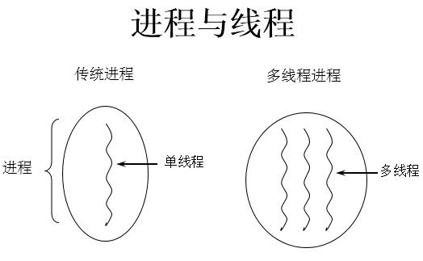
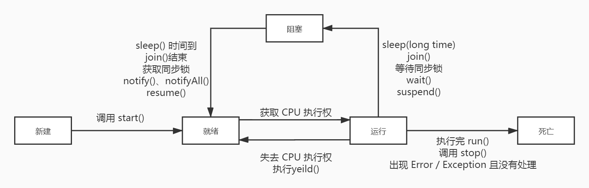

## 基本概念

### 程序 program
程序是为完成特定任务、用某种语言编写的一组指令的集合，是指**一段静态的代码**

### 进程 process
* 进程是程序的一次**执行过程**，或是**正在运行**的一个程序，是一个动态过程，有它自身的产生、存在和消亡的过程——生命周期
* 进程作为**资源分配的单位**，系统在运行时会为每个进程分配不同的内存区域

### 线程 thread
进程可进一步细化为线程，线程是一个程序内部的一条执行路径
* 如果一个进程同一时间并行的执行多个线程，就是支持多线程的
* 线程是**调度和执行的单位**，每个线程拥有独立的运行栈和程序计数器（program couter），线程切换的开销小
* 一个进程中的多个线程共享相同的内存单元/内存地址空间，它们**从同一堆中分配对象**，可以访问相同的变量和对象，线程间通信更简便高效，但多个线程操作共享的系统资源可能带来安全隐患
* 一个 Java 程序至少有3个线程：主线程 main()，垃圾回收线程 gc()，异常处理线程



### 单核CPU与多核CPU
单核 CPU 是假的多线程，在一个时间单元内，只能执行一个线程的任务，但是 CPU 频率很高，时间单元很短，可以快速在不同线程之间**切换执行**，多核 CPU 才可以更好的发挥多线程的效率

### 并行与并发
* 并行：多个 CPU 同时执行多个任务（同一时刻可以多个进程在运行）
* 并发：一个 CPU 使用时间片同时执行任务（经过上下文快速切换，使得看上去多个进程同时都在运行的现象）

### 使用多线程优点
1. 提高应用程序的相应，对图形化界面更有意义，增强用户体验
2. 提高计算机系统 CPU 利用率
3. 改善程序结构

### 何时使用多线程
1. 程序需要同时执行两个或多个任务
2. 程序需要实现一些需要等待的任务，比如用户输入，文件读写
3. 需要一些后台运行的程序

## 线程的创建和使用

### 方式一 继承 Thread 类
1. 创建一个继承于 Thread 类的子类
2. 重写 Thread 类的 run()，将此线程执行的操作声明在 run() 中
3. 创建 Thread 类的子类的对象
4. 通过此对象调用 start()
```java
class MyThread extends Thread {
    private static int num = 100;

    @Override
    public void run() {
        while(true) {
            if(num>0) {
                try {
                    Thread.sleep(100);
                    System.out.println("当前线程为：" + getName() + ",余量为：" + num);
                }catch (InterruptedException e) {
                    e.printStackTrace();
                }
                num--;
            }else {
                break;
            }
        }
    }
}

public class MyThreadTest {
    public static void main(String[] args) {
        MyThread t1 = new MyThread();
        MyThread t2 = new MyThread();
        MyThread t3 = new MyThread();
        t1.setName("线程一");
        t2.setName("线程二");
        t3.setName("线程三");
        t1.start();
        t2.start();
        t3.start();
    }
}
```
**注意**
1. start() 方法的作用：启动当前线程，然后调用**当前线程**的 run() 方法
2. 如果直接调用 run() 方法，则**不会启动多线程**，run() 方法依然由主线程执行
3. 已经 start() 的线程不可以再次启动，因为线程启动后，status 会被改变，再次启动会报线程状态非法的异常
4. 如果需要开启两个线程，各自有不同的操作，则需要创建两个 Thread 的子类，然后各自创建自己的对象
5. 注意，上面的例子是**线程不安全**的，num 是静态的，多个线程都可以去修改其值

### Thread 类的属性和常用方法

**线程的优先级**
* MAX_PRIORITY：10
* MIN _PRIORITY：1
* NORM_PRIORITY：5（默认优先级）

**常用方法**
```java
// 启动当前线程，调用当前线程的 run()
start()

// 将创建的线程要执行的操作声明在此方法中，需要重写
run()

// 静态方法，返回执行当前代码的线程
currentThread()

// 获取当前线程的名字
getName()

// 设置当前线程的名字，应在线程 start() 之前执行
setName()

// 释放当前线程的 CPU 的执行权
yield()

// 在线程 a 中调用线程 b 的 join() 方法，此时线程 a 进入阻塞状态，直到线程 b 完全执行完毕以后，线程 a 才结束阻塞
join()

// 静态方法，使当前线程“睡眠” millitime 毫秒数，在此时间内，当前线程是阻塞状态
sleep(long millitime)

// 判断当前线程是否存活
isAlive()

// 获取当前线程的优先级
getPriority()

// 设置当前线程的优先级
setPriority(int p)

// 已过时。强制结束当前线程
stop()
```

**说明**：高优先级的线程要抢占低优先级线程 CPU 的执行权。但是只是从概率上讲，高优先级的线程高概率的情况下被执行，并不意味着只当高优先级的线程执行完以后，低优先级的线程才执行。

### 方式二 实现 Runnable 接口
1. 创建实现了 Runnable 接口的类
2. 实现 Runnable 接口中的 run() 方法
3. 创建类的对象
4. 将此对象**作为参数**传递到 Thread 类的构造器中，创建 Thread 类的对象
5. 通过 Thread 类的对象调用 start() 方法

```java
class MyThread implements Runnable {
    private int num = 100;
    @Override
    public void run() {
        while(true) {
            if(num>0) {
                try {
                    Thread.sleep(100);
                    System.out.println("当前线程为：" + Thread.currentThread().getName() + ",余量为：" + num);
                }catch (InterruptedException e) {
                    e.printStackTrace();
                }
                num--;
            }else {
                break;
            }
        }
    }
}

public class MyThreadTest {
    public static void main(String[] args) {
        MyThread t = new MyThread();
        Thread t1 = new Thread(t);
        Thread t2 = new Thread(t);
        Thread t3 = new Thread(t);
        t1.setName("线程一");
        t2.setName("线程二");
        t3.setName("线程三");
        t1.start();
        t2.start();
        t3.start();
    }
}
```
**注意**：start() 方法的作用：启动当前线程，调用当前线程的 run() 方法，如果构造器传入的参数不是 null，则调用 Runnable 类型的 target 的 run()

### 方式一和方式二的比较
* 优先选择：实现 Runnable 接口的方式
    1. 没有类的单继承性的局限性
    2. 更适合来处理多个线程共享数据的情况
* 联系：Thread 类同样实现了 Runnable 接口，并重写的 run() 方法
* 相同点
    1. 两种方式都需要重写 run()，将线程要执行的逻辑声明在 run() 中。
    2. 目前两种方式，要想启动线程，都是调用的 Thread 类中的 start()。

## 线程的生命周期
Java 中使用 Thread 类及其子类的对象来表示线程，Thread.State 类定义了线程的几种状态
1. 新建：当一个 Thread 类或子类的对象被声明并创建时，新生的线程对象处于新建状态
2. 就绪：处于新建状态的线程 start() 之后，将进入线程队列等待 CPU 时间片，此时它已经具备了运行的条件，只是没有分配到 CPU 资源
3. 运行：当就绪的线程被调度并获得 CPU 资源时，进入运行状态，run() 方法定义了线程的操作和功能
4. 阻塞：在某种特殊情况下，被认为挂起或执行输入输出操作时，让出 CPU 资源并临时终止自己的执行，进入阻塞状态
5. 死亡：线程完成了它的全部工作或线程被提前强制性地终止或出现异常导致结束

对于线程的生命周期一是关注其状态，二是关注改变状态的方法



## 线程的同步
### 线程安全问题
* 出现的原因：当某个线程操作共享数据的过程中，尚未操作完成时，其他线程参与操作
* 解决办法：当一个线程 A 操作共享数据时，其他线程不可参与操作，直到线程 A 完成操作（**即使**线程 A 在操作过程中成为阻塞状态也不能改变）
* Java 中使用同步机制解决线程安全问题

### 方式一 同步代码块
```java
synchronized (同步监视器) {
    //需要被同步的代码
}
```
1. 操作共享数据的代码，即为需要被同步的代码
2. 同步监视器：即 **锁**，任何一个类的对象，都可以充当锁
3. 要求：多个线程必须要共用**同一把锁**
4. 在实现 Runnable 接口创建多线程的方式中，可以考虑使用 **当前对象 this** 充当同步监视器。
5. 在继承 Thread 类创建多线程的方式中，考虑使用**当前类**（例如 MyThread.class）充当同步监视器，慎用 this，因为继承 Thread 实现多线程需要创建多个对象，并不是同一把锁
```java
class MyThread implements Runnable {
    private int num =100;
    @Override
    public void run() {
        while(true) {
            synchronized(this) {
                if (num > 0) {
                    try {
                        Thread.sleep(100);
                        System.out.println("当前线程为：" + Thread.currentThread().getName() + ",余量为：" + num);
                    } catch (InterruptedException e) {
                        e.printStackTrace();
                    }
                    num--;
                } else {
                    break;
                }
            }
        }
    }
}
```

### 方式二 同步方法
* 如果操作共享数据的代码完整的声明在一个方法中，不妨将此**方法声明为同步**的，直接使用 synchronized 关键字修饰方法
* 同步方法仍然涉及到同步监视器，只是**不需要显式的声明锁**
* 非静态的同步方法，同步监视器是**当前对象 this 本身**。所以，对于实现 Runnable 接口的方式创建的线程，可以直接使用同步方法
* 静态的同步方法，同步监视器是**当前类本身**。所以，对于继承 Thread 类的方式创建的线程，需要把同步方法声明为**静态**的

### 方式三 Lock
Lock 是 JDK5.0 新增的解决线程安全的方式，一般使用其实现类 ReentrantLock
```java
import java.util.concurrent.locks.ReentrantLock;

class MyThread implements Runnable {
    private int num =100;
    // 1. 实例化ReentrantLock
    private ReentrantLock lock = new ReentrantLock(true); //是否是公平锁
    @Override
    public void run() {
        while(true) {
            try {
                // 2. 加锁
                lock.lock();
                if (num > 0) {
                    try {
                        Thread.sleep(100);
                        System.out.println("当前线程为：" + Thread.currentThread().getName() + ",余量为：" + num);
                    } catch (InterruptedException e) {
                        e.printStackTrace();
                    }
                    num--;
                } else {
                    break;
                }
            } finally {
                // 3. 解锁
                lock.unlock();
            }
        }
    }
}
```
**注意**
* synchronized 机制在执行完相应的同步代码以后，**自动释放**同步监视器
* Lock 需要手动的启动同步 lock()，结束同步也需要手动的实现 unlock()，使用 Lock 锁，JVM 将会花费较少时间来调度线程，性能更好，扩展性更好
* 建议使用的优先顺序：
    1. Lock，更灵活
    2. 同步代码块（已经进入了方法体，分配了相应资源）
    3. 同步方法（在方法体之外）

### 线程安全的单例模式
饿汉式，线程安全
```java
public class Bank {
    private Bank(){}
    private static Bank instance = new Bank();
    public static Bank getInstance() {
        return instance;
    }
}
```
没有线程同步的懒汉式，线程不安全
```java
public class Bank {
    private Bank(){}
    private static Bank instance = null;
    public static Bank getInstance() {
        if(instance == null) {
            instance = new Bnak();
        }
        return instance;
    }
}
```
加了锁的懒汉式，线程安全
```java
public class Bank {
    private Bank(){}
    private static Bank instance = null;
    public static Bank getInstance() {
        // 双重检查锁，提高效率，如果单例已经存在，直接获取，不用抢锁
        if(instance==null) {
            synchronized(Bank.class) {
                if(instance == null) {
                    instance = new Bank();
                }
            }
        }
        return instance;
    }
}
```

### 死锁
* 不同的线程分别占用对方需要的同步资源不释放，都在**等待对方释放**自己需要的同步资源，就形成了线程的死锁
* 出现死锁后，不会出现异常，不会出现提示，只是所的线程都处于**阻塞状态**，无法继续执行
* 避免死锁：专门的算法和原则，减少同步资源的定义，避免嵌套同步

## 线程的通信
### 线程通信涉及到的三个方法
```java
// 执行此方法，当前线程就进入阻塞状态，并释放同步监视器
wait()

// 执行此方法，就会唤醒被 wait 的一个线程。如果有多个线程被 wait，就唤醒优先级高的那个
notify()

// 一旦执行此方法，就会唤醒所有被 wait 的线程
notifyAll()
```

### 说明
* wait()，notify()，notifyAll() 三个方法必须在**同步代码块**或**同步方法**中调用
* wait()，notify()，notifyAll() 三个方法的**调用者**必须是同步代码块或同步方法中的**同步监视器**。否则，会出现 IllegalMonitorStateException 异常

### sleep() 和 wait() 的异同
* 相同点：一旦执行方法，都可以使得当前的线程进入阻塞状态
* 不同点
    1. 两个方法声明的位置不同：sleep() 声明在 Thread 类中，wait() 声明在 Object 类中
    2. 调用的要求不同：sleep() 可以在任何需要的场景下调用，wait() 必须使用在同步代码块或同步方法中
    3. 关于是否释放同步监视器：如果两个方法都使用在同步代码块或同步方法中，sleep() 不会释放锁，wait() 会释放锁

### 会释放锁的情况
1. 当前线程的同步代码块、同步方法执行完毕
2. 同步代码块、同步方法中的 break、return 语句终止代码块、方法的执行
3. 同步代码块、同步方法中出现了没有处理的 Error 或 Exception
4. 同步代码块、同步方法中调用 wait() 方法，当前线程进入阻塞状态


### 生产者消费者问题
```java
class Buffer {
    private Buffer(){}

    private static Buffer instance = new Buffer();

    public static Buffer getInstance() {
        return instance;
    }

    int productCount = 0;

    public synchronized void produceProduct() {
        if(productCount<20) {
            productCount++;
            System.out.println("生产者生产，当前 product count = " + productCount);
            notify();
        }else {
            try {
                wait();
            }catch(InterruptedException e) {
                e.printStackTrace();
            }

        }
    }

    public synchronized void consumeProduct() {
        if(productCount>0) {
            productCount--;
            System.out.println("消费者消费，当前 product count = " + productCount);
            notify();
        }else {
            try {
                wait();
            } catch (InterruptedException e) {
                e.printStackTrace();
            }
        }
    }
}

class Producer implements Runnable {
    Buffer buffer;

    public Producer(Buffer buffer) {
        this.buffer = buffer;
    }
    @Override
    public void run() {
        while(true) {
            try {
                Thread.currentThread().sleep(100);
            } catch (InterruptedException e) {
                e.printStackTrace();
            }
            buffer.produceProduct();
        }
    }
}

class Consumer implements Runnable {
    Buffer buffer;

    public Consumer(Buffer buffer) {
        this.buffer = buffer;
    }
    @Override
    public void run() {
        while(true) {
            try {
                Thread.currentThread().sleep(210);
            } catch (InterruptedException e) {
                e.printStackTrace();
            }
            buffer.consumeProduct();
        }
    }
}

public class ProductTest {
    public static void main(String[] args) {
        Producer producer = new Producer(Buffer.getInstance());
        Consumer consumer = new Consumer(Buffer.getInstance());

        Thread p1 = new Thread(producer);
        p1.setName("生产者1");

        Thread c1 = new Thread(consumer);
        c1.setName("消费者1");

        Thread c2 = new Thread(consumer);
        c2.setName("消费者2");

        p1.start();
        c1.start();
        c2.start();

    }
}
```

## JDK5.0 新增线程创建方式
### 方式一 实现 Callable 接口
Callable 接口和 Future 接口都在 java.util.concurrent 包下
1. 创建一个实现了 Callable 接口的类
2. 实现 call() 方法，将此线程需要执行的操作声明在 call() 方法中，call() 方法是有返回值的
3. 创建该 Callable 接口实现类的对象
4. 将此 Callable 接口实现类的对象作为参数传递到 FutureTask 类（Future 接口的一个实现类）的构造器中，创建 FutureTask 的对象
5. 将 FutureTask 的对象作为参数传递到 Thread 类的构造器中，创建 Thread 类的对象，并调用 start()
6. 如果需要使用 call() 的返回值，调用 FutureTask 的 get() 方法即可
```java
import java.util.concurrent.Callable;
import java.util.concurrent.ExecutionException;
import java.util.concurrent.FutureTask;

// 创建实现了 Callable 接口的类
class MyThread implements Callable {
    // 重写 call 方法，声明此线程要做的操作
    @Override
    public Object call() throws Exception {
        int sum = 0;
        for(int i=1;i<=1000;i++) {
            if(i%2==0) {
                sum += i;
                System.out.println(i);
            }
        }
        return sum;
    }
}

public class CallableTest {
    public static void main(String[] args) {
        // 创建实现 Callable 接口的类的对象
        MyThread mythread = new MyThread();
        // 创建 FutureTask 的对象，并将实现 Callable 接口的类的对象作为参数传入
        FutureTask futureTask = new FutureTask(mythread);
        // 将 FutureTask 类的对象作为 Thread 构造器的参数传入，创建 Thread 对象，启动线程
        new Thread(futureTask).start();

        // FutureTask 的 get() 的返回值即 call() 返回的返回值
        try {
            Object sum = futureTask.get();
            System.out.println("计算结果为"+sum);
        } catch (InterruptedException e) {
            e.printStackTrace();
        } catch (ExecutionException e) {
            e.printStackTrace();
        }
    }
}
```
与实现 Runnable 接口相比，Callable 功能更强大
* call() 方法可以有返回值
* call() 方法可以抛出异常，被外面的操作捕获，获取异常的信息
* call() 支持泛型的返回值

### 方式二 线程池
提前创建好多个线程，放入线程池，使用时直接获取，使用完放回池中，可以避免频繁的创建销毁线程，实现线程的重复利用

### 相关 API
线程池相关的类都定义在 java.util.concurrent 包下
* ExecutorService：线程池接口
* ThreadPoolExecutor：ExecutorService 的常见实现类

```java
public void execute(Runnable command)
// 执行任务，没有返回值，一般用来执行 Runnable

public <T> Future<T> submit(Callable<T> task)
// 执行任务，有返回值，一般用来执行 Callable

void shutdown() 
// 关闭线程池
```
* Executors ：线程池的工厂类，用于创建并返回不同类型的线程池
```java
Executors.newCachedThreadPool()
// 创建一个线程数根据任务动态调整的线程池

Executors.newFixedThreadPool(int corePoolSize)
// 创建一个线程数固定的线程池

Executors.newSingleThreadExecutor () 
// 创建一个仅单线程执行的线程池

Executors.newScheduledThreadPool(int corePoolSize)
// 创建一个线程池，它可安排在给定延迟后运行命令或者定期地执行
```

### 使用线程池的好处
1. 减少了创建新线程的时间，提高响应速度
2. 降低资源消耗，重复利用线程池中线程，不需要每次都创建
3. 便于线程管理
    * corePoolSize：核心池的大小
    * maximumPoolSize：最大线程数
    * keepAliveTime：线程没任务时最多保持多长时间后会终止
```java
import java.util.concurrent.*;

public class ThreadPoolTest {
    public static void main(String[] args) {
        // 通过工厂类 Executors 获得有 10 个线程的线程池，并强转为 ThreadPoolExecutor 类型
        ThreadPoolExecutor myThreadPool = (ThreadPoolExecutor)Executors.newFixedThreadPool(10);

        // 向线程池提交任务，实现 Runnable 接口的 和实现 Callable 接口的类的对象用不同的方法
        myThreadPool.execute(new MyThread2());
        myThreadPool.submit(new MyThread1());

        // 关闭线程池
        myThreadPool.shutdown();
    }
}

// 创建实现了 Callable 接口的类
class MyThread1 implements Callable {
    // 重写 call 方法，声明此线程要做的操作
    @Override
    public Object call() throws Exception {
        int sum = 0;
        for(int i=1;i<=1000;i++) {
            if(i%2==0) {
                sum += i;
                System.out.println(Thread.currentThread().getName() + ":"+i);
            }
        }
        return sum;
    }
}

class MyThread2 implements Runnable {
    @Override
    public void run() {
        int sum = 0;
        for(int i=1;i<=1000;i++) {
            if(i%2==0) {
                sum += i;
                System.out.println(Thread.currentThread().getName() + ":"+i);
            }
        }
    }
}
```