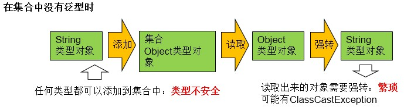
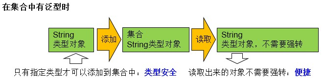

## 概念
泛型，就是允许在定义类、接口时通过一个**标识**表示类中某个属性的类型或者是某个方法的返回值及参数类型。这个**类型参数**将在**使用时**，例如，继承或实现这个接口，用这个类型声明变量、创建对象时**确定**（即传入实际的类型参数，也称为类型实参）。

集合容器类在设计阶段/声明阶段不能确定这个容器到底实际存的是什么类型的对象，所以在 JDK5.0 之前只能把元素类型设计为 Object，JDK5.0 之后使用泛型来解决。因为这个时候除了元素的类型不确定，其他的部分是确定的，例如关于这个元素如何保存，如何管理等是确定的，此时把**元素的类型**设计成一个**参数**，这个类型参数叫做泛型。

Collection<E>，List<E>，ArrayList<E>   这个<E>就是类型参数，即泛型。

如果不使用泛型，使用集合存储的对象可以是任何类型，出现类型安全问题，在使用集合中存储的对象时，需要进行强制转换，可能出现 ClassCastException



## 泛型在集合中的使用
* 集合接口或集合类在 JDK5.0 时都修改为带泛型的结构
* 在实例化集合类时，可以指明具体的泛型类型
* 指明完以后，在集合类或接口中凡是内部结构使用到类的泛型的位置，都指定为实例化的泛型类型
* 注意点：泛型的类型必须是类，不能是基本数据类型。需要用到基本数据类型的位置，用包装类替换
* 如果实例化时，没指明泛型的类型，默认类型为java.lang.Object



```java
// 创建集合类实例时，指定类型参数（泛型）的实际类型
ArrayList<Integer> list = new ArrayList<>();
list.add(11);
list.add(22);
list.add(33);

// 无法添加非 Integer 类型的对象，编译无法通过
//list.add("string");

// 使用带泛型的迭代器遍历
Iterator<Integer> it = list.iterator();
while(it.hasNext()) {
    // 明确了元素类型，直接使用对应的类型变量接受，不用强转，不会出错
    int num = it.next();
    System.out.println(num);
}

/*以上遍历也可使用增强 for，IDEA 推荐*/
for (int num : list) {
    System.out.println(num);
}
```

嵌套使用泛型
```java
HashMap<String,Integer> map = new HashMap<>();
map.put("apple",98);
map.put("huawei",100);
map.put("xiaomi",99);
Set<HashMap.Entry<String,Integer>> entrySet = map.entrySet();
Iterator<HashMap.Entry<String,Integer>> it = entrySet.iterator();
while(it.hasNext()) {
    HashMap.Entry<String,Integer> ele = it.next();
    String k = ele.getKey();
    Integer v = ele.getValue();
    System.out.println("key:" + k + " ,value:" + v);
}
```

## 自定义泛型类、泛型接口、泛型方法
### 泛型类和泛型接口
```java
class Order<T> {
    String name;
    int id;
    T orderT;
    T[] arrT;

    public Order(String name, int id, T orderT) {
        this.name = name;
        this.id = id;
        this.orderT = orderT;

        //arrT = new T[100];
        arrT = (T[]) new Object[100];
    }

    public T[] getArrT() {
        return arrT;
    }

    public void setOrderT(T orderT) {
        this.orderT = orderT;
    }

    // 静态方法中不能使用类的泛型
    // public static void setOrderT(T orderT) {}

    // 异常类不能是泛型的
    /*
    public void show() {
        try{

        }catch(T t) {

        }
    }
     */
}
```
**注意**
1. 类名后加 <类型参数名> 可以在类内部使用该泛型
2. 不可以直接 new 泛型类型
3. 静态方法不能使用类的泛型，类的泛型的具体类型是在创建对象时才确定的
4. 异常类不能是泛型的
5. 如果定义了泛型类，实例化没指明类的泛型，则认为此泛型类型为 Object 类型
6. 泛型不同的引用不能互相赋值

### 泛型方法
```java
public static <E> List<E> copyFromArrayToList(E[] arr){
    ArrayList<E> list = new ArrayList<>();
    for(E e : arr){
        list.add(e);
    }
    return list;

}
```
**注意**
1. 泛型方法：在方法中出现了泛型的结构，泛型参数与类的泛型参数没任何关系，也就是说，泛型方法所属的类是不是泛型类都没关系。
2. 泛型方法，可以声明为静态的。因为泛型参数是在调用该泛型方法时确定的，并非在实例化类时确定。

## 泛型在继承上的体现
1. 父类有泛型，子类可以选择保留泛型，也可选择指定泛型
    1. 子类不保留父类的泛型，按需实现
        * 没有类型
        * 具体类型
    2. 子类保留父类的泛型
        * 全部保留
        * 部分保留

2. 如果子类在继承带泛型的父类时，指明了泛型类型，则实例化子类对象时，不再需要指明泛型

3. 假设存在 3 个类 G、A、B，其中类 A 是类 B 的父类，但是
    * 类 A\<G\> 是类 B\<G\> 的父类
    * 类 G\<A\> 和类 G\<B\>二者不具备子父类关系，二者是并列关系

## 通配符

### 非限定通配符
* 类 \G<?\> 是 类 G\<A\> 和类 G<\B\> 的共同的父类
* 使用通配符 \<?\> 作为泛型的容器不能添加数据（除了添加null），可以获取数据
```java
ArrayList<?> list = new ArrayList<>();
// list.add("string");
list.add(null);
System.out.println(list.get(0)); // null
```

### 限定通配符
* 使用 List<? extends C> list 这种形式，表示 list 可以引用一个 ArrayList（或者其它 List 的 子类）的对象，这个对象包含的元素类型是 C 的子类型（包含 C 本身）的一种，也就是指定了上限，但是
    * 允许调用 get() 获取 C 类型及以上的引用并赋值给 C （或者其父类）类型变量，因为存放的对象最高是 C 类的，向上转型可以安全接收
    * 不允许调用 set() 存放任何类型的元素，因为容器内部并不知道具体存放了何种类型的对象（但是可以存放 null）
* 使用 List<? super C> list 这种形式，表示 list 可以引用一个 ArrayList（或者其它 List 的 子类）的对象，这个对象包含的元素就类型是 C 的超类型（包含 C 本身）的一种，即指定了下限，但是
    * 允许调用 set() 存放任意类型的对象，因为已经知道了要存的对象至少是 A 类型的
    * 调用 get() 取出的元素只能赋给 Object，因为存入的具体类型的上限不知道，只能赋给 Object

参考：[Java 泛型总结（三）：通配符的使用](https://segmentfault.com/a/1190000005337789)
