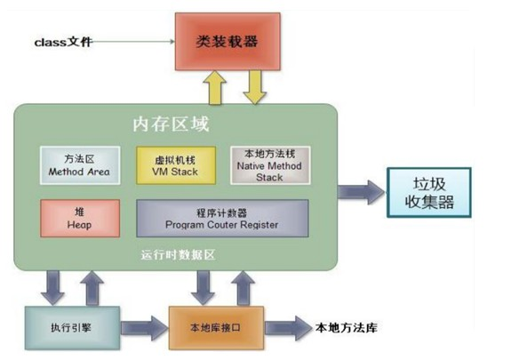

## 基本概念
* 面向对象基于面向过程，对象中包含属性和行为，将过程封装在对象之中，让程序员从过程的执行者转变到对象的指挥者
* 面向对象易维护、易复用、易扩展。 因为面向对象有封装、继承、多态性的特性，所以可以设计出低耦合的系统，使系统更加灵活、更加易于维护
* 三条主线
    * 类及类的成员：属性、方法、构造器、代码块、内部类
    * 面向对象三大特征：封装、继承、多态
    * 关键字：this、super、static、final、abstract、interface、package、import等
* 『万物皆对象』：Java 中，功能和结构都封装到类中，通过类的实例化，来调用具体功能，例如文件File，网络资源URL，前后端交互、后端与数据库交互时前端和数据库的结构在Java 中都体现为类和对象

## 类与对象
* 类是相同或相似对象的一种抽象，是对象的一个模板，它描述对象的行为和状态
* 对象是类的实体或实例（instance）
### 创建类
类的创建就是设计类的成员
```java
// 权限修饰符 class 类名
public class People {
    //属性（成员变量） 有什么
    double height;  //身高
    int age;     //年龄
    int sex;    //性别，0为男性，非0为女性
    String name;    //姓名
    
    //方法 干什么
    void cry() {
        System.out.println("我在哭！");
    }
    void laugh() {
        System.out.println("我在笑！");
    }
    void printBaseInfo() {
        System.out.println("我的身高是" + height + "cm");
        System.out.println("我的年龄是" + age + "岁");
        if(this.sex==0)
            System.out.println("我是男性！");
        else 
            System.out.println("我是女性！");
        System.out.println("我的姓名是" + name);
    }
}
```
### 创建对象
使用 new 关键字可以创建一个新的对象，在创建对象实例时，需要为对象实例设置一个变量名
```java
People p = new People();
```
p 并不是对象实例本身，而是一个堆空间中 People 对象的引用（类似 C 语言的指针），引用指向该对象
```java
People p1 = new People(); // 创建了一个新的对象，引用p1指向该对象
People p2 = new People(); // 创建了一个新的对象，引用p2指向该对象
People p3 = p1; // 没有创建新的对象，引用p3与p1指向相同的对象
System.out.println(p1==p2); // false
System.out.println(p1==p3); // true（p1与p3所保存的地址值相同）
```
### 使用对象
使用 **对象.属性** 或 **对象.方法** 调用对象的结构。一个类如果创建了多个对象，则每个对象都会保存一份独立的（非静态的）属性，修改一个对象的属性，不会影响另外一个对象的属性。
```java
p1.age = 18; // 设置p1所指向的对象的age属性为18
p2.age = 19; // 设置p2所指向的对象的age属性为19
p3.age = 20; // 设置p3所指向的对象的age属性为20
p1.laugh(); // "我在笑！"
Syetem.out.println(p1.age); // 20，p3与p1指向相同的对象
Syetem.out.println(p1.age); // 19
```
### 匿名对象
* 匿名对象即没有名字的对象，是创建对象时的简化定义方式
* 匿名对象可以作为实参传递
* 若对象的方法只进行一次调用，则可以使用匿名对象
* 匿名对象的生命周期只限于该语句，所以使用匿名对象进行属性的赋值并无意义
```java
new People().laugh(); // "我在笑！"
new People().age = 21; // 无意义
System.out.println(new Pwople().age); // 0
```
### 源文件书写规则
1. 一个源文件中只能定义一个 public 类，可定义多个非 public 类。
2. 源文件名必须与 public 类的类名相同。
3. package 语句必须在源文件首行，import 语句应在package 语句和类定义之间。
4. package 语句和 import 语句对源文件中定义的所有类都有效。
5. 同一源文件中不能给不同类以不同的包声明，同一包下不可以有同名类。

## 类的结构之一：属性 field
1. **局部变量**
    * 局部变量定义在方法（包括构造器）的方法体或参数列表中，或代码块内。
    * 局部变量的作用域仅限于定义它的方法内，方法结束后，局部变量就会自动销毁。
    * 局部变量如果没有显示初始化，不会赋默认值，在使用前一定要显示的赋值。
    * 局部变量不能被权限修饰符及 static 所修饰。
    * 局部变量储存在虚拟机栈中。
2. **成员变量**
    * 成员变量定义在类中，方法体之外。
    * 成员变量的作用域在整个类内部都是可见的。
    * 成员变量如果没有被赋初值，则会自动以类型的默认值而赋值。
    * 成员变量和局部变量同名时，本方法中的局部变量具有更高的优先级。
    * 根据是否使用 static 修饰成员变量分为静态变量和实例变量
        * 非静态的实例变量储存在堆空间的对象中，在创建对象的时候实例化。
        * 类变量储存在方法区，随着类的加载而加载。

**JVM 内存结构**

虚拟机栈：局部变量  
堆：new 出来的结构（数组、对象），非静态成员变量  
方法区：类加载信息、常量池、静态域

## 类的结构之二：方法 method
方法用来描述类的功能，方法的声明如下
```java
权限修饰符 其他修饰符 返回值类型 方法名(参数列表) {
    方法体
}
// 其他修饰符：static,final,abstract
```
### return 关键字
return 关键字用在方法体内，用于结束方法和返回需要的数据，return 语句后不可再声明其他语句
### 方法重载 overload
在同一个类中，允许一个以上的同名方法，只要它们的参数个数或参数类型不同，与方法的权限修饰符、返回值类型、形参变量名、方法体没有关系。  
如下 4 个方法构成了重载
```java
public void getSum(int i,int j) {
    System.out.println("1");
}
	
public void getSum(double d1,double d2) {
    System.out.println("2");
}

public void getSum(String s ,int i) {
    System.out.println("3");
}

public void getSum(int i,String s) {
    System.out.println("4");
}
```

### 值传递机制
* 如果变量是基本数据类型，变量所保存的是真实的数据值。
* 如果变量是引用数据类型，变量所保存的是其指向的对象的地址值。
* Java 中方法的参数传递都可以看做是副本传递，即将实参所保存的值拷贝一份赋给形参去操作。
* 如果是对基本数据类型的数据进行操作，由于原始内容和副本都是存储实际值，并且是在不同的栈区，因此形参的操作，不影响原始内容。
* 如果是对引用类型的数据进行操作，分两种情况
    * 一种是形参和实参保持指向同一个对象地址，则形参的操作，会影响实参指向的对象的内容
    * 一种是形参被改动指向新的对象地址（如重新赋值引用），则形参的操作，不会影响实参指向的对象的内容。

## 封装
配合使用权限修饰符，隐藏对象的属性和方法的实现细节，仅对外提供公共的访问方式，控制在程序中属性的读和修改的访问级别。通俗的说，把该隐藏的隐藏起来，该暴露的暴露出来。使用封装的好处是：将变化隔离，方便修改和实现，提高代码复用性，提高安全性，提高系统的可扩展性、可维护性。

### 四种权限修饰符
权限修饰符 public、proteced、缺省（默认）、private 置于类的成员（属性、方法、构造器、内部类）定义前，用来限定对象对该类成员的访问权限

|修饰符|类内部|同包|不同包的子类|同一个工程|
|---|---|---|---|---|
|private|✔|
|缺省|✔|✔|
|protected|✔|✔|✔|
|public|✔|✔|✔|✔|
**注意**：对于 class 的访问权限只有 public 和缺省，public 类可以在任意地方访问，缺省类只可以被同包的类访问。

### 实现类的封装
1. 修改属性的可见性，在属性的前面添加修饰符（如 private）。
2. 对每个值属性提供对外的公共方法访问，如创建 getter/setter（取值和赋值）方法，用于对私有属性的访问。
3. 在 getter/setter 方法里加入属性的控制语句，例如我们可以加一个判断语句，对于非法输入给予否定。
```java
public class People {
// 属性（成员变量）有什么，前面添加了访问修饰符private
// 变成了私有属性，必须通过方法调用
    private double height;     //身高

// 属性已经封装好了，如果用户需要调用属性
// 必须用getter和setter方法进行调用
// getter和setter方法需要程序员自己定义
    public double getHeight() {    
    //getter 方法命名是get关键字加属性名（属性名首字母大写）
    //getter 方法一般是为了得到属性值
        return height;
    }

// 同理设置setter方法
// setter 方法命名是set关键字加属性名（首字母大写）
// setter 方法一般是给属性值赋值，所以有一个参数
    public void setHeight(double newHeight) {
        height = newHeight;
    }
}

public class NewObject {

    public static void main(String[] args) {
        People LiLei = new People();    //创建了一个People对象LiLei

        //利用setter方法为属性赋值
        LiLei.setHeight(170.0);

        //利用getter方法取属性值
        System.out.println("LiLei的身高是"+LiLei.getHeight());
    }
}
```


## 类的结构之三：构造器 Constructor
### 构造器的作用
* 创建对象：在创建一个对象的时候，至少要调用一个构造器。
* 初始化对象信息 

### 构造器的使用
* 每个类都至少有一个构造器。如果没有显式地为类定义构造器，Java 编译器将会为该类提供一个默认的空参构造器。一旦我们显式的定义了类的构造器之后，系统就不再提供默认的空参构造器。
* 定义构造器的格式
```java
权限修饰符 类名(形参列表){}
// 构造方法的名称必须与类同名，无返回值类型和返回值
```
* 通过方法重载，一个类可以有多个构造器。
* 构造方法若用 private 修饰，则不可使用该构造方法创建对象，但在本类的其他构造方法中仍然可以调用。
* 构造函数使用 this 关键字可以互相调用
```java
public class People {
    //属性（成员变量）有什么
    double height;     //身高
    int age;           //年龄
    int sex;       //性别，0为男性，非0为女性

    //无参构造方法
    public People(){

    }
    //有一个参数的构造方法
    public People(int age){
        this.age = age;
    }
    //构造方法，初始化了所有属性
    public People(double height,double age,int sex){
        this(age);
        this.height = height;
        this.sex = sex;
    }
}

//创建对象，调用自定义的有参构造方法
public class NewObject {
    public static void main(String[] args) {
        People LiLei = new People(168, 21, 1); //创建一个People对象LiLei，并通过构造器对对象的属性进行初始化
        // 修改对象的属性
        LiLei.height =170;
        LiLei.age = 20;
    }
}
```
### 类属性赋值顺序
1. 默认初始化
2. 显示初始化
3. 构造器初始化
4. 通过 对象.方法 或 对象.属性的方式赋值

### JavaBean
满足以下标准的类即 JavaBean
* 类是公共的
* 有一个无参的公共的构造器
* 有属性和对应的get、set方法

## this 关键字
* this 关键字代表当前对象或当前正在创建的对象。
* 可以使用 this 关键字的结构：属性、方法、构造器
* 在方法中：使用 this.属性 操作当前对象的属性，this.方法 调用当前对象的方法。一般情况下可以省略 this. ，但是当成员变量和局部变量（例如方法的形参）间发生冲突时，必须在属性名前面前室添加 this.
```java
public void setHeight(double height) {
    this.height = height;
}
```
* 在构造器中：可以显式的使用 this(形参列表) 方式，调用本类中指定的其他构造器，如果一个类中有 n 个构造器，则最多有 n - 1 个构造器中使用了 this(形参列表) ，要注意递归问题
* 使用 this 调用其他构造器的语句只能定义在构造器的第一行，且只能出现一次


## package 和 import
为了更好地组织类，Java 提供了包机制，用于区别类名的命名空间。
### package 包
* 作用：把功能相似或相关的类或接口组织在同一个包中，方便类的查找和使用。
* 包采用了树形目录的存储方式。同一个包中的类名字是不同的，不同的包中的类的名字是可以相同的，当同时调用两个不同包中相同类名的类时，应该加上包名加以区别。因此，包可以避免类名或接口名冲突。
* 包也限定了访问权限，拥有包访问权限的类才能访问某个包中的类。
* 使用 package 声明类或接口所属的包，写在源文件的首行。
* 包名全部小写，见名知意
* 包名中每 . 一次就代表一层文件目录。
```java
package 包名
//注意：必须放在源程序的第一行，包名可用"."号隔开
```
```java
package com.shiyanlou.java 
//包中用"."来分层
```
**JDK 中常用包**
1. java.lang  
包含一些 Java 语言的核心类，如 String，Math，System，Thread，包装类等
2. java.net  
包含执行与网络相关的操作的类和接口
3. java.io  
包含能提供多种输入输出功能的类
4. java.util  
包含一些使用工具类和接口，如 Arrays，集合框架，日期相关
5. java.text  
包含一些 Java 格式化相关的类
6. java.sql  
包含 Java 进行 JDBC 数据库编程的相关类和接口

### import 导包
* 使用 import 关键字，显示的导入指定包下的类或接口
* 同时如果 import com.shiyanlou.* 这是
```java
import com.yzt95.People // 导入com.yzt95包下的Pelple类
import com.yzt95.* // 将com.yzt95包下的所有文件都导入进来，*是通配符
```
* 如果在源文件中，使用了不同包下的同名类或接口，则至少有一个类需要使用全类名，即类名前加包名
* 类或接口如果在lang包下或本包内定义，使用时可以省略 import
* import static：导入指定类或接口中的静态属性或方法